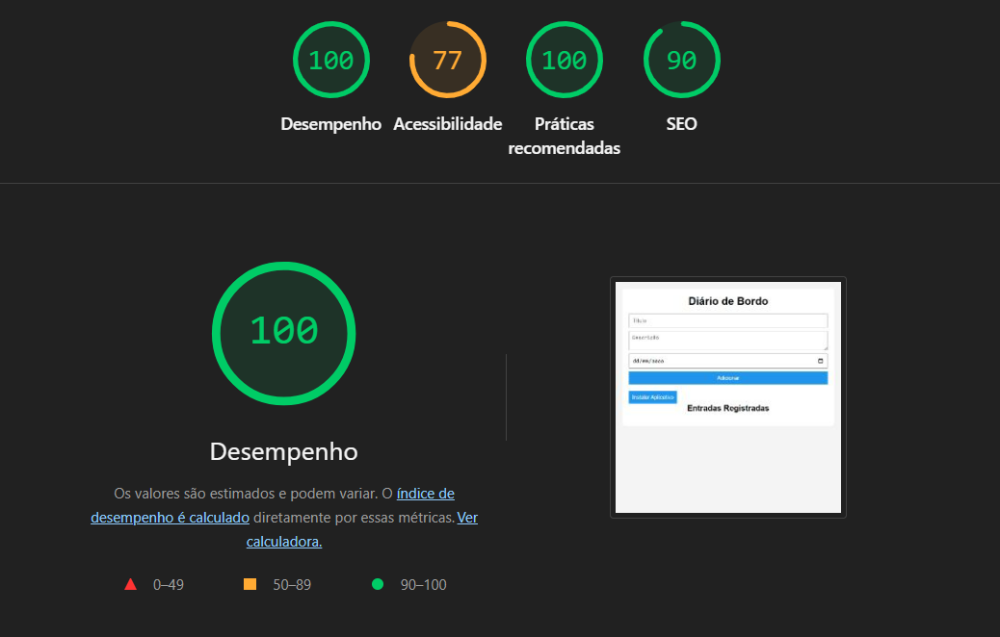
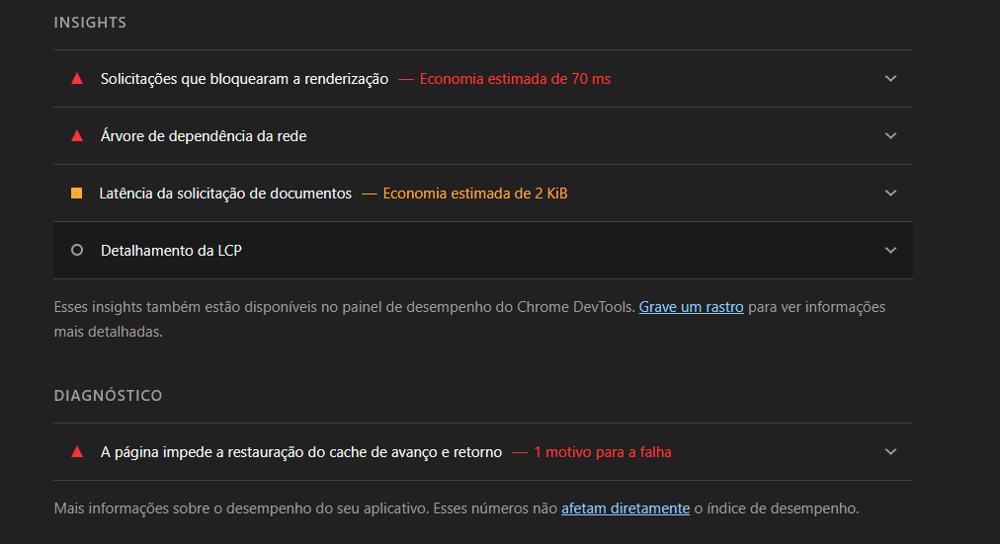
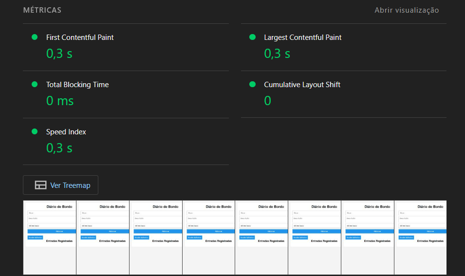
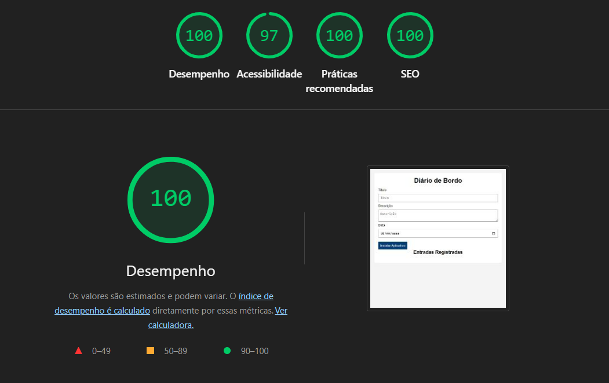
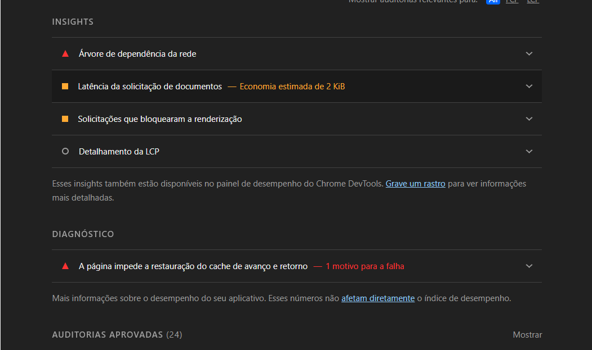
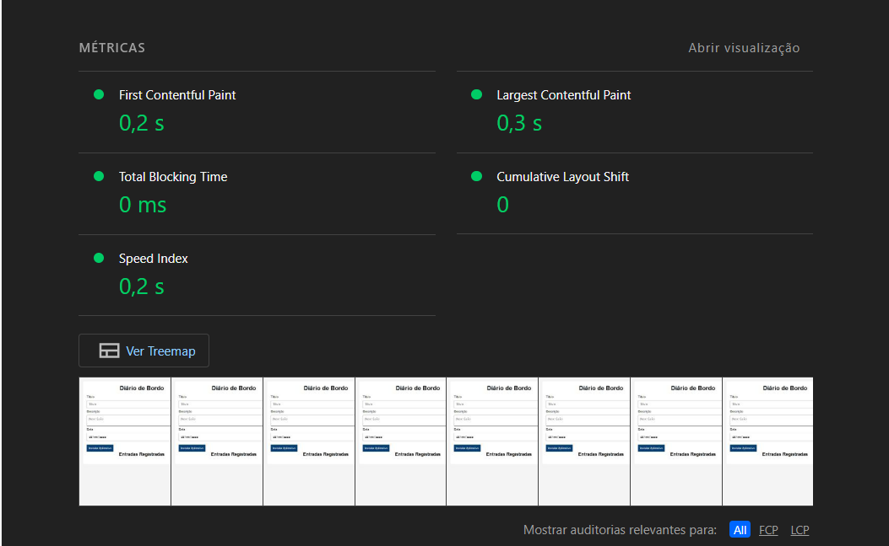

# Diário de Bordo - Otimização de Performance Web

## Descrição do Projeto

O Diário de Bordo é uma aplicação web desenvolvida para registrar atividades e anotações diárias. O sistema permite adicionar, visualizar e remover entradas, armazenando os dados localmente através do Local Storage. Além disso, o projeto foi configurado como um Progressive Web App (PWA), possibilitando instalação no dispositivo e funcionamento offline.

## Tecnologias Utilizadas

* HTML5
* CSS3
* JavaScript
* Local Storage
* Service Worker
* Manifest PWA

## Objetivo da Atividade

Aplicar técnicas de otimização de performance web utilizando as ferramentas Lighthouse e Chrome DevTools, identificando gargalos e implementando melhorias para aumentar a velocidade de carregamento, estabilidade e qualidade geral da aplicação.

## Análise Inicial

Foi realizada uma análise utilizando o Lighthouse para identificar possíveis problemas de performance.

### Gargalos Identificados

* Ausência de meta description para SEO.
* Carregamento do JavaScript sem uso do atributo defer.
* Consultas repetidas ao DOM no JavaScript.
* Múltiplas manipulações do DOM durante a renderização da lista.
* Estratégia simples de cache no Service Worker.
* Presença de regras CSS redundantes.
* Falta de tratamento de erros em operações importantes.
* Não foram encontrados gargalos relacionados a imagens, uma vez que a aplicação não utiliza recursos visuais desse tipo.

### Relatório Antes das Otimizações

Exemplo:

## Melhorias Aplicadas

### HTML

* Adicionada meta description.
* Adicionado favicon da aplicação.
* Utilização do atributo defer no carregamento do arquivo JavaScript.
* Adição de labels

* # Imagens
O projeto não utiliza imagens em sua interface. Dessa forma, não foi necessária a aplicação de técnicas de compressão, conversão para WebP/AVIF ou carregamento lazy loading.

### CSS

* Remoção de regras redundantes.
* Revisão dos estilos para manter apenas os necessários.
* Utilização de fontes nativas do sistema.
* Alteração no contraste dos buttons em relação a cor do backgound

### JavaScript

* Redução de consultas repetidas ao DOM.
* Otimização da renderização da lista de entradas.
* Organização e simplificação do código.
* Adição de validações extras no processo de instalação do PWA.
* Implementação de tratamento de erros.

### Service Worker

* Implementada limpeza automática de caches antigos.
* Melhor gerenciamento de versões do cache.
* Adicionado suporte a atualização mais rápida do Service Worker.
* Tratamento de falhas de rede.

### PWA

* Revisão e melhoria do arquivo manifest.json.
* Ajustes para melhor compatibilidade com dispositivos móveis.

## Relatório Após as Otimizações

Exemplo:

## Comparação dos Resultados

| Métrica        | Antes | Depois |
| -------------- | ----- | ------ |
| Performance    | 100   |  100   |
| Accessibility  | 70    |  97    |
| Best Practices | 100   |  100   |
| SEO            | 90    |  100   |

|Evidências específicas        | Antes | Depois |
| ---------------------------- | ----- | ------ |
|First Contentful Paint (FCP)  | 0,3 s |  0,2 s |
|Largest Contentful Paint (LCP)| 0,3 s |  0,3 s |
|Total Blocking Time           | 0 ms  |  0 ms  |
|Speed index                   | 0,3 s |  0,2 s |

Mesmo com a pontuação de Performance já em seu valor máximo, observou-se uma pequena melhoria nos tempos de carregamento após as otimizações realizadas.

## Análise da Métrica de Performance

Durante a avaliação inicial utilizando o Lighthouse, a aplicação já apresentou pontuação máxima (100) na categoria Performance. Isso ocorreu porque o projeto possui estrutura simples, sem utilização de bibliotecas pesadas, imagens de grande porte, vídeos, fontes externas ou requisições de rede complexas.

Mesmo mantendo a pontuação 100 após as otimizações, foram realizadas melhorias importantes relacionadas à eficiência do código e às boas práticas de desenvolvimento, incluindo:

* Utilização do atributo `defer` para carregamento do JavaScript.
* Redução de consultas repetidas ao DOM.
* Otimização da renderização dinâmica da lista de entradas.
* Revisão do Service Worker e da estratégia de cache.
* Remoção de código redundante.
* Melhoria da estrutura semântica do HTML.

Dessa forma, embora a nota geral de Performance tenha permanecido em seu valor máximo, as otimizações contribuíram para tornar o código mais eficiente, organizado e alinhado às boas práticas recomendadas para aplicações web modernas.

## Melhorias com Maior Impacto

As alterações que mais contribuíram para a melhoria da aplicação foram:

* Otimização do carregamento do JavaScript utilizando defer.
* Redução das manipulações repetidas do DOM.
* Melhoria da estratégia de cache do Service Worker.
* Limpeza de código redundante.
* Inclusão de configurações adicionais para SEO.
* Inclusão de atributos de acessibilidade nos elementos interativos.

## Aplicação

O projeto pode ser executado localmente em qualquer navegador moderno.

## Repositório

Link do repositório GitHub:

https://github.com/Joao-P90/Diario-de-bordo.git

## Conclusão

Após a análise e aplicação das otimizações, foi possível melhorar a qualidade geral da aplicação, reduzindo possíveis gargalos de carregamento e adotando boas práticas de desenvolvimento web. As melhorias implementadas contribuíram para uma experiência de usuário mais rápida, estável e eficiente.
